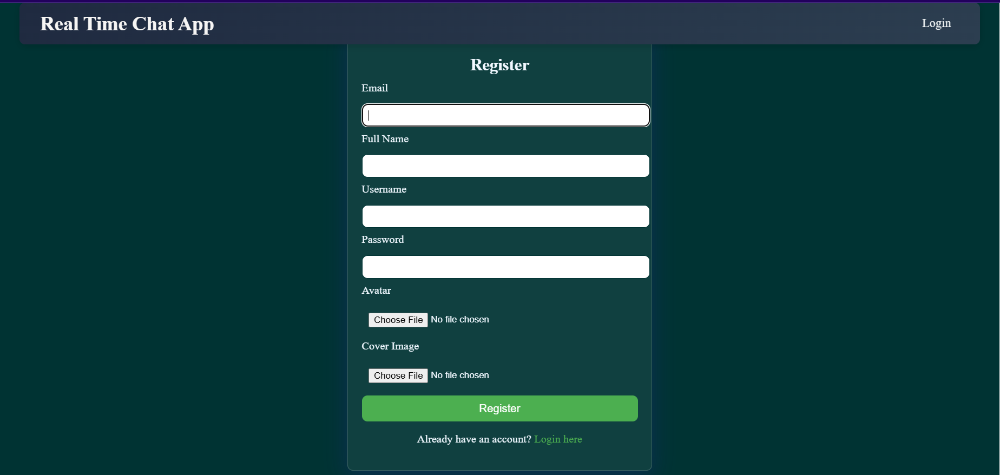
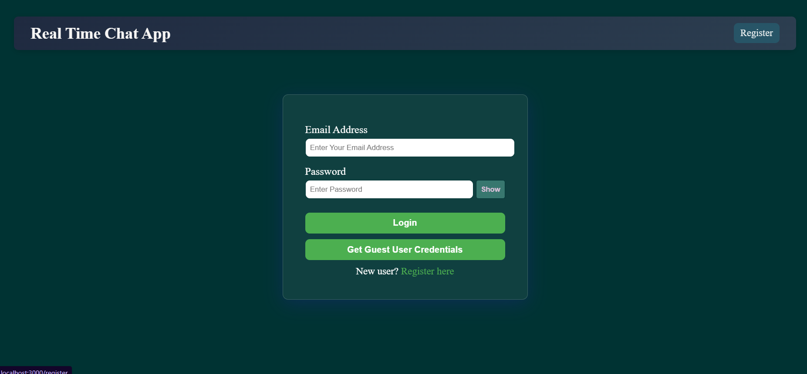
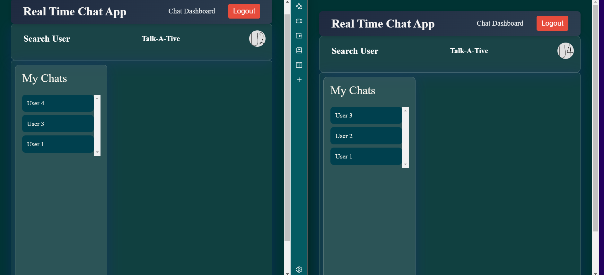
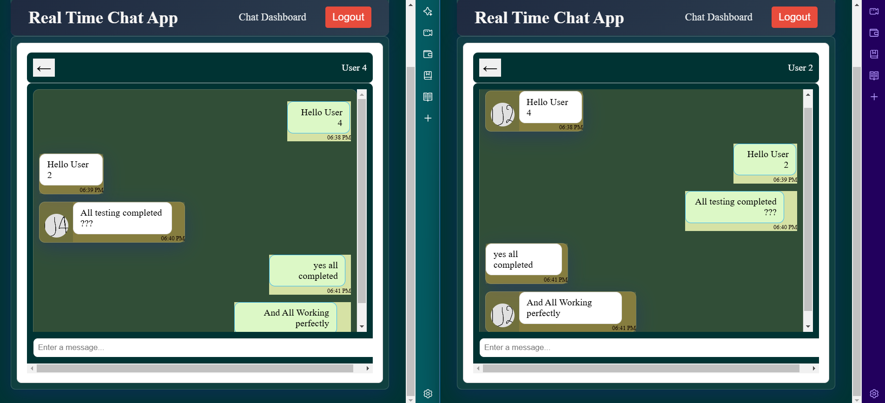

# Real-Time Chat Application - Frontend

This is the frontend of the Real-Time Chat Application, built using React.js. The application provides a seamless and interactive user interface for real-time messaging.

## Features
- User authentication (Signup/Login)
- Real-time messaging with Socket.io
- Profile management
- Group chat support
- Media sharing (Images, Files)
- Typing indicators & Read receipts
- Responsive design for mobile and desktop

## Screenshots

1. **Register Page**  
   

2. **Login Page**  
   

3. **Chat Dashboard**  
   

4. **Chat Window**  
   

5. **Chats**  
   

## Getting Started

### Prerequisites
Ensure you have Node.js installed.

### Installation
```bash
cd chat-frontend
npm install
```

### Running the Application
```bash
npm start
```
Open [http://localhost:3000](http://localhost:3000) to view the application.

## Technologies Used
- React.js
- Context API
- Axios

## Contributing
Pull requests are welcome. For major changes, please open an issue first to discuss.

---
